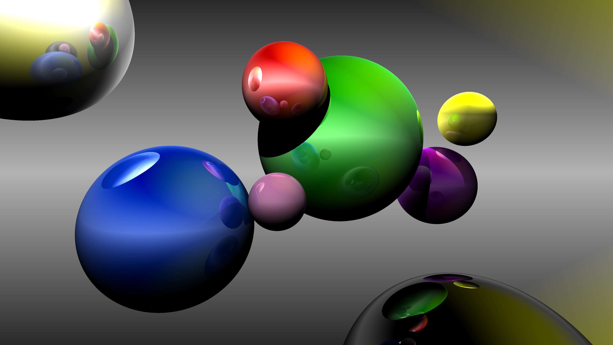
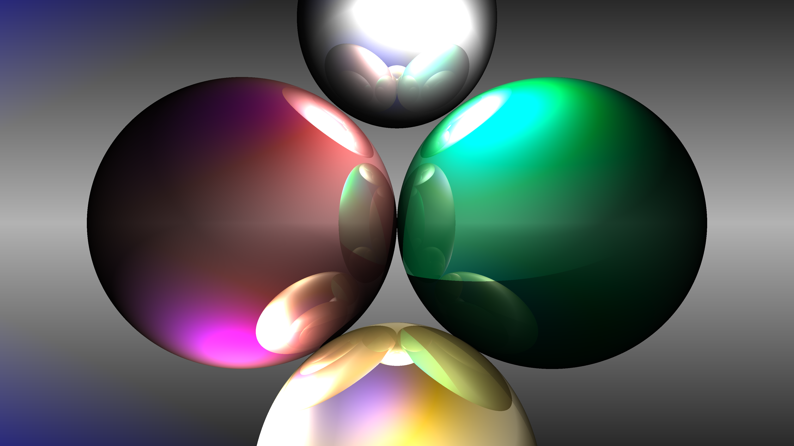

# Starlight

This project is a simple ray tracer, written in Rust, that is based on skimming
the [Physically Based Rendering book](http://www.pbr-book.org/3ed-2018/contents.html).

It can render scenes like these:

